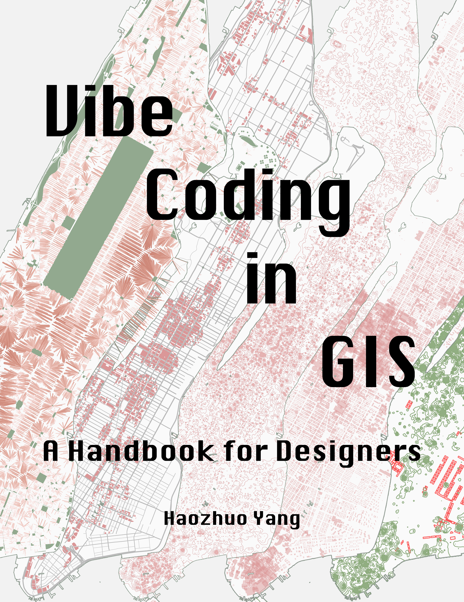

# Vibe Coding in GIS: A Handbook for Designers

**Haozhuo Yang**, M.Arch in Urban Design, Harvard Graduate School of Design



---

## About

This handbook introduces vibe coding as a method for spatial analysis and expressive cartography in GIS. It is written for designers, planners, and researchers who work with spatial data but do not have programming backgrounds.

The approach uses AI assistants to generate executable GIS code from natural language descriptions, enabling conversational access to geoprocessing operations, multi-criteria analysis, and per-feature geometric transformations.

Based on "Experimental Cartography: Vibe Coding for GIS," a J-Term course taught by the author at the Harvard Graduate School of Design, January 2026.

## Download

📄 **[Download the Handbook (PDF)](https://github.com/themothalex/vibe-coding-gis-handbook/releases/latest)**

🌐 **[Project Page](https://vibe-coding-gis.haozhuoyang.com/)**

## Workshop Data

The `workshop-data/` folder contains the ArcGIS Pro project package used in the handbook workshops. The dataset covers Manhattan and includes building footprints, parcel boundaries, subway stops, zoning districts, census tracts, and open spaces.

### Setup

1. Download `Manhattan_Workshop.ppkx` from the `workshop-data/` folder
2. Double-click to open in ArcGIS Pro (version 3.0 or later)
3. All layers will load automatically into your Contents pane


## Contents

1. **Introduction** — The procedural mismatch between design practice and GIS
2. **A Field Guide to Vibe Coding in GIS**
    - 2.1 Vibe Coding as a Method
    - 2.2 Spatial Analysis with Vibe Coding (Workshops 2-1 through 2-3)
    - 2.3 Expressive Cartography with Vibe Coding (Workshops 2-4 through 2-6)
    - 2.4 Building Reusable Tools (Workshops 2-7 and 2-8)
3. **Limitations & Risks**
4. **Case Study** — Harvard GSD J-Term Course
5. **The Analytical Designer**

## Citation

If you use this handbook in teaching, research, or practice, please cite:

> Yang, Haozhuo. *Vibe Coding in GIS: A Handbook for Designers.* 2026.

BibTeX:

```bibtex
@book{yang2026vibecoding,
  title     = {Vibe Coding in GIS: A Handbook for Designers},
  author    = {Yang, Haozhuo},
  year      = {2026},
  note      = {Based on a course taught at Harvard Graduate School of Design},
  url       = {https://vibe-coding-gis.haozhuoyang.com/}
}
```

## License

This work is licensed under [CC BY-NC-SA 4.0](https://creativecommons.org/licenses/by-nc-sa/4.0/).

You are free to share and adapt this material with attribution, for non-commercial purposes, under the same license.

